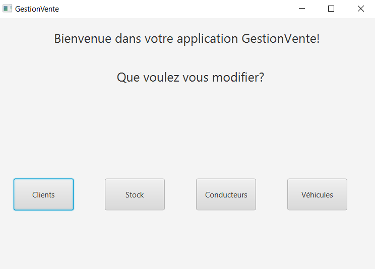

<div align="center">
  <h1 align="center">Sales Management Application</h1>
    <p align="center">
    Our Sales Management Application, built with Java & JavaFX
</div>

## About The Project

**Sales Management** is a desktop application developed using Java and JavaFX. Created as a university project, this application helps small businesses manage their sales, stock, and transactions without a database system.

## Built With

[](https://www.java.com/)  
[](https://openjfx.io/)  
[](https://gradle.org/)

## Getting Started

### Folder Structure

```markdown
SalesManagement/
├── 📁 bin/               # Compiled class files
├── 📁 build/             # Build outputs
├── 📁 lib/               # External libraries
├── 📁 src/               # Source code
│   ├── 📁 main/          # Main application code
│   └── 📁 test/          # Unit tests
├── 📄 build.gradle       # Gradle build configuration
├── 📄 gradlew            # Unix Gradle wrapper
├── 📄 gradlew.bat        # Windows Gradle wrapper
├── 📄 settings.gradle    # Gradle settings
├── 📄 .gitignore         # Git ignore file
└── 📄 README.md          # Project documentation
```

### Prerequisites

Ensure you have the following installed:

```sh
Java 17+
Gradle
JavaFX SDK
```

### Installation & Build

1. Clone the repository:

```sh
git clone https://github.com/JulesBobeuf/SalesManagement.git
cd SalesManagement
```

2. Build the project using Gradle:

```sh
./gradlew build
```

3. Run the application:

```sh
./gradlew run
```

### Running the Application

After building, the application will launch the main GUI where you can manage products and sales.

## Resources

- [JavaFX Documentation](https://openjfx.io/)  
- [Gradle User Manual](https://docs.gradle.org/current/userguide/userguide.html)  

## License

This project is licensed under the MIT License. See the [LICENSE](LICENSE) file for details.

## Contact

Jules Bobeuf  
[LinkedIn](https://www.linkedin.com/in/bobeuf-jules/)  
bobeuf.jules@gmail.com

Aymeric Jakobowski  
[LinkedIn](https://www.linkedin.com/in/aymeric-jakobowski/)  
[GitHub](https://github.com/AymericJak)
